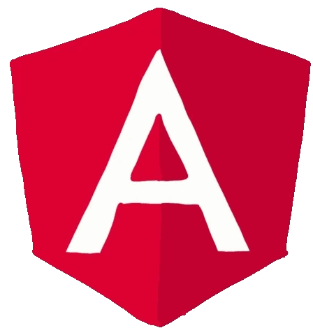

# video-player-ng



A feature-rich **Angular** video player with modern controls, including double-tap to skip/back 10s, mini player mode, and more.

## Features

- Double tap to skip forward/backward 10 seconds.
- Mini player mode for a floating video experience.
- Custom controls: play, pause, seek, volume, and full-screen.
- Responsive design for all screen sizes.
- Optimized performance with Angular best practices.

## Setup

Clone the repository and install dependencies:

```bash
git clone https://github.com/yourusername/video-player-ng.git
cd video-player-ng
npm install
```

## Usage

Run the project locally:

```bash
ng serve
```

Then open your browser and go to `http://localhost:4200/`.

## Customization

You can modify the player controls and styles within the Angular component files.

## Contributing

Feel free to submit issues or pull requests to improve the project.

## License

MIT License.

